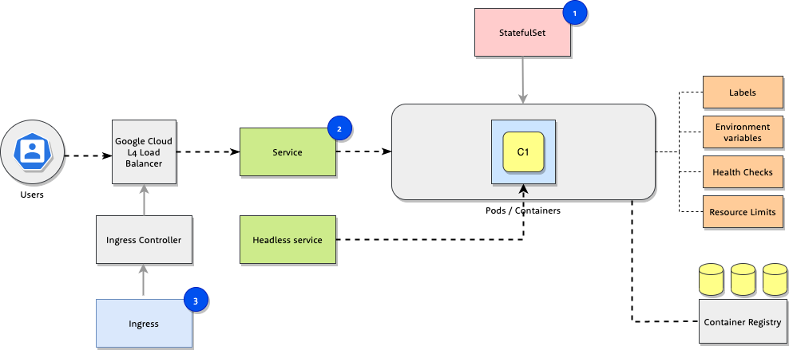

# [Workshop](../README.md) &raquo; Basic objects

## Objective

In this task you will learn how to describe and inspect a simple application as
a kubernetes stateful set and expose it to the outside world.

## Introduction

* [Application details](#application-details)
* [Task overview](#task-overview)
* [Useful commands](#useful-commands)

## Hands on tasks

1. [Labels and annotations](#1-add-annotations-and-labels-to-pod-definitions)
2. [Environment variables](#2-add-environment-variables)
3. [Pod health checks](#3-add-pod-health-checks)
4. [Pod resource limits](#4-define-cpu-and-memory-resources)
5. [Service](#5-deploy-service)
6. [Ingress](#6-configure-ingress)

## Application details


We have prepared a workshop application container with the following features:

1. The containerized application is an `http` server listening on HTTP port `80`.
2. There are several `http paths` exposed within the container:
    * `/` - serves *Space Invaders*
    * `/hello` - this path will respond with `Hello, $CODE` message, where `$CODE` is an environment variable set in the definition of a pod.
    * `/live` - Health check liveness probe , where application reports its current status. While the application is running it returns `HTTP 200` code. If the application has been running for more than ten minutes, it will respond with `HTTP 500` error.
    * `/ready` - Health check readiness probe, where application reports if it is ready to accept web request. If the application is ready to accept traffic, this path will respond with `HTTP 200` response.
3. Application resource requirements:
    * Between `10m` and `100m` CPU.
    * Between `32M` and `128M` Memory.

The source code for the application is available [here](../06_setup/code/main.go).

## Task overview

Current directory contains three kubernetes objects that are stripped to bare working minimum.



Objects:

1. `StatefulSet` - Object containing application definition. This is the file we will be editing in workshop tasks.
2. `Service` - Object used to expose the application pods internally within the cluster.
3. `Ingress` - Object to expose the application externally on the URL `https://$CODE.k8s.3fs.si` where `$CODE` is you personalized workshop code.

Your task is to extend the objects with additional options to give Kubernetes more information how to run your application and to align with best practices.

## Useful commands

See [kubectl cheat sheet](https://kubernetes.io/docs/reference/kubectl/cheatsheet/) for full command reference.

```bash
kubectl get all
kubectl describe statefulset/workshop-example
kubectl describe service/workshop-example
kubectl describe ingress/workshop-example
kubectl describe pod/workshop-example-0
kubectl logs -f pod/workshop-example-0
kubectl apply -f service.yaml
kubectl replace --force -f statefulset.yaml
```

## Tasks

### 1. Add annotations and labels to pod definitions

Current `Pod` definition in `statefulset.yaml` lacks definition of `annotations`.

1. Add the following annotations to `Pod` definition (yaml: `.spec.template.metadata.annotations`):
    * `workshop-name: k8s-workshop-episode-2`
    * any annotation of your choice

2. Update `Pod` definition with the following `labels` (yaml: `.spec.template.metadata.labels`):
    * `code: $CODE`, where `$CODE` is your workshop code

> Hint: use example in `statefulset.yaml`

After you have updated the `statefulset.yaml`, deploy the application with the following command.

```sh
kubectl apply -f statefulset.yaml
```

Inspect the deployed objects by using the following `kubectl` commands:

```sh
kubectl get all
kubectl describe statefulset/workshop-example
kubectl describe pod/workshop-example-0
kubectl logs pod/workshop-example-0
```

Select deployed objects filtering using your label.

```sh
kubectl get all -l code=$CODE
```

<details>
  <summary>Show solution</summary>

Update file `statefulset.yaml`. (change `cranky-hippo` to your workshop `$CODE`)

```diff
--- statefulset.yaml	2020-05-26 17:38:05.000000000 +0200
+++ solutions/01_statefulset.yaml	2020-05-26 17:25:32.000000000 +0200
@@ -14,31 +14,18 @@ spec:
       name: workshop-app-example
   template:
     metadata:
-      annotations: {}
+      annotations:
+        workshop: k8s-workshop-episode-2
+        date: "2020-05-27"
       labels:
         name: workshop-app-example
+        code: cranky-hippo
     spec:
       containers:
         - name: workshop-app-example
```

Deploy to cluster:

```sh
kubectl replace --force -f statefulset.yaml
```

You can check the full solution [here](./solutions/01_statefulset.yaml).

</details>

### 2. Add environment variables

The application is using environment variables for configuration. The environment variable `CODE` is displayed on HTTP endpoint `/hello`. You can check that response by visiting `https://$CODE.k8s.3fs.si/hello`.

Add the environment variables:

* `CODE` with the value of your workshop code to `Pod` definition of the `StatefulSet` (yaml: `.spec.template.spec.containers[0].env`)
* `WORKSHOP_USERNAME` with custom value `k8s-workshop`. This value will be used in the future tasks.

> Hint: use example in `statefulset.yaml`

After you have updated the `statefulset.yaml`, deploy the application with the following command.

```sh
kubectl replace --force -f statefulset.yaml
```

Inspect the deployed object by using `kubectl describe` commands.

```sh
kubectl describe statefulset/workshop-example
kubectl describe pod/workshop-example-0
```

Check pods environment by entering the running pod using `kubectl exec` command and running `env` command.

```sh
kubectl exec pod/workshop-example-0 env
```

<details>
  <summary>Show solution</summary>

Update file `statefulset.yaml` (change `cranky-hippo` to your workshop `$CODE`).

```diff
--- 01_statefulset.yaml	2020-05-26 17:59:28.000000000 +0200
+++ 02_statefulset.yaml	2020-05-26 17:25:32.000000000 +0200
@@ -25,8 +25,12 @@ spec:
         - name: workshop-app-example
           image: "eu.gcr.io/k8s-workshop-2/app:latest"
           imagePullPolicy: IfNotPresent
-          env: []
           ports:
             - name: http
               containerPort: 80
               protocol: TCP
+          env:
+            - name: CODE
+              value: "cranky-hippo"
+            - name: WORKSHOP_USERNAME
+              value: "k8s-workshop"
```

Deploy to cluster:

```sh
kubectl replace --force -f statefulset.yaml
```

You can check the full solution [here](./solutions/02_statefulset.yaml).

</details>

### 3. Add pod health checks

The application has no health check configured.

Add health check definitions to `Pod` definition in `StatefulSet`:

* add `livenessProbe` with the following definition (yaml key: `.spec.template.spec.containers[0].livenessProbe`)

  ```console
  livenessProbe:
    httpGet:
      path: /live
      port: http
  ```

* add `readinessProbe` with the following definition (yaml key: `.spec.template.spec.containers[0].readinessProbe`)

  ```console
  readinessProbe:
      httpGet:
        path: /ready
        port: http
  ```

> Hint: use example in `statefulset.yaml`

After you have updated the `statefulset.yaml`, deploy the application with the following command.

```sh
kubectl replace --force -f statefulset.yaml
```

Inspect the `pod/workshop-example-0` object by using `kubectl describe pod/workshop-example-0` command.

```sh
kubectl describe statefulset/workshop-example
kubectl describe pod/workshop-example-0
```

<details>
  <summary>Show solution</summary>

Update file `statefulset.yaml`

```diff
--- 02_statefulset.yaml	2020-05-26 17:25:32.000000000 +0200
+++ 03_statefulset.yaml	2020-05-26 17:25:32.000000000 +0200
@@ -34,3 +34,11 @@ spec:
               value: "cranky-hippo"
             - name: WORKSHOP_USERNAME
               value: "cranky-hippo"
+          livenessProbe:
+            httpGet:
+              path: /live
+              port: http
+          readinessProbe:
+            httpGet:
+              path: /ready
+              port: http
```

Deploy to cluster:

```sh
kubectl replace --force -f statefulset.yaml
```

You can check the full solution [here](./solutions/03_statefulset.yaml).

</details>

### 4. Define CPU and Memory resources

Current definition of StatefulSet lacks information about resource usage.

Update definition of `Pod` in `StatefulSet` with the following limits:

* when the container is starting, it should requests `10m` of CPU time and `32M` of memory.
* the container should be limited to `100m` of CPU time and `128M` of memory

Use the following definitions in `.spec.template.spec.containers[0].resources`:

```console
  requests:
    cpu: 10m
    memory: 32Mi
  limits:
    cpu: 100m
    memory: 128Mi
```

Within the workshop `console` container updated `StatefulSet` definition to the cluster:

```sh
kubectl replace --force -f statefulset.yaml
```

Inspect the `pod/workshop-example-0` object with `kubectl` command.

```sh
kubectl describe pod/workshop-example-0
```

<details>
  <summary>Show solution</summary>

Update file `statefulset.yaml`

```diff
--- 03_statefulset.yaml	2020-05-26 17:25:32.000000000 +0200
+++ 04_statefulset.yaml	2020-05-26 17:25:43.000000000 +0200
@@ -42,3 +42,10 @@ spec:
             httpGet:
               path: /ready
               port: http
+          resources:
+            requests:
+              cpu: 10m
+              memory: 32Mi
+            limits:
+              cpu: 100m
+              memory: 128Mi
```

Deploy to cluster:

```sh
kubectl replace --force -f statefulset.yaml
```

You can check the full solution [here](./solutions/04_statefulset.yaml).

</details>

### 5. Deploy Service

Expose the application inside Kubernetes cluster by deploying a service. It is defined in `service.yaml`.

Pods running in Kubernetes will now be able to talk to your application on port 80 using the service.

```sh
kubectl describe service/workshop-example
```

<details>
  <summary>Show solution</summary>

Deploy to cluster:

```console
kubectl apply -f service.yaml
```

</details>

### 6. Configure Ingress

To expose the service to Internet Ingress object needs to be created.
Additionally, if we want to use HTTPS, the certificate has to be present in the
kubernetes environment. The certificate must be stored in kubernetes Secret
object and referenced in Ingress definition.

A .yaml file to create the wildcard certificate secret is located in the `/`
folder of Docker container. This object will be important in the future tasks.
Apply it using the following command:

```bash
kubectl create -f /k8s.3fs.si-cert.yaml
```

After successful import of certificate Secret object, we can create Ingress
object to expose service to Internet.

To expose the service to the Internet edit hostname in
`ingress.yaml` to include `$CODE` (e.g.
`cranky-hippo.k8s.3fs.si`). To edit file you can use included `vim` or `nano`
editors (quick guide how to use them is
[here](https://www.howtoforge.com/faq/how-to-edit-files-on-the-command-line)).

The `spec` section should look similar to:

```yaml
  tls:
    - hosts:
        - "cranky-hippo.k8s.3fs.si"
      secretName: k8s.3fs.si-certificate
  rules:
    - host: "cranky-hippo.k8s.3fs.si"
      http:
        paths:
          - path: /
            backend:
              serviceName: workshop-example
              servicePort: 80
```

Create the Ingress object named `workshop-example` using the following command.

```bash
kubectl apply -f ingress.yaml
```

Inspect the ingress object.

```sh
kubectl describe ingress workshop-example
```

## Success

Your workshop application has now been deployed. Replace `$CODE` with your workshop code.

Access:

* Space invaders: `https://$CODE.k8s.3fs.si`.
* Hello: `https://$CODE.k8s.3fs.si/hello`.

Kubernetes dashboard:

* All deployed resources: https://dashboard.k8s.3fs.si/#/overview?namespace=$CODE
* Pod information: https://dashboard.k8s.3fs.si/#/pod/$CODE/workshop-example-0?namespace=$CODE
* Logs: https://dashboard.k8s.3fs.si/#/log/$CODE/workshop-example-0/pod?namespace=$CODE

Things to check:

* Pod CPU and Memory Resource consumption
* Pod Metadata
* Pod container environment variables
* Pod Events (*hint: pod liveness probe will fail after 10min.*)
* Pod Logs
* Service definition
* Ingress definition
* Secret used for HTTPS

## Next: [Volumes](../02_volumes/README.md)
