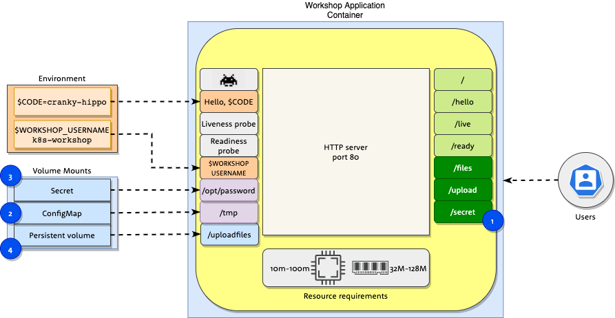
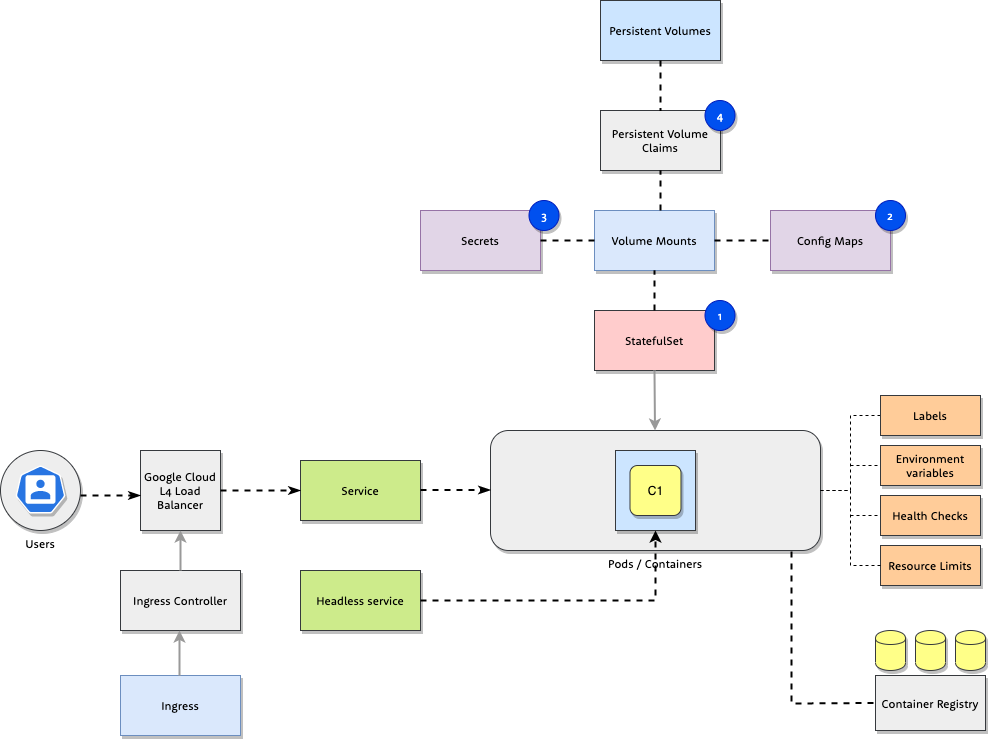

# [Workshop](../README.md) &raquo; Volumes

## Objective

In this task you will learn how to configure pod deployments by using Secrets,
ConfigMaps and Persistent volumes mounting them as volumes to Pod objects.

## Introduction

* [Application details](#application-details)
* [Task overview](#task-overview)
* [Useful commands](#useful-commands)

## Hands on tasks

1. [ConfigMap object](#1-add-configmap-to-statefulset)
2. [Secret object](#2-add-secret-to-statefulset)
3. [PersistentVolume object](#3-add-persistentvolume-to-statefulset)
4. [Remove all objects](#4-remove-all-created-objects)

## Application details



Workshop application container also supports the following functionality:

1. Additional http endpoints for `/files` `/upload` and `/secret`.
2. Application can be configured to display files, which are stored in `/tmp`,
   when you open `https://$CODE.k8s.3fs.si/files` web page. These files can be
   stored in `ConfigMap` and mounted into the container.
3. Application can be configured to password protect *Space Invaders* when
   environment variable `WORKSHOP_USERNAME` is set and `/opt/password` file
   exists with password. Password protected *Space Invaders* are accessible on
   `https://$CODE.k8s.3fs.si/secret/`.
4. Application supports uploading files and storing them permanently to
   `PersistentVolume`. You can upload files using
   `https://$CODE.k8s.3fs.si/upload` endpoint.

## Task overview



Objects:

1. `StatefulSet` - Object containing application definition. This is the file we will be editing in workshop tasks.
2. `ConfigMap` - Config map containing files served at `/files` endpoint.
3. `Secret` - Secret for access to *Space invaders* game.
4. `Persistent Volume Claim` - Volume to store uploaded files.

Your task is extension of the `StatefulSet` created in section [Basic
Objects](../01_basic_objects/README.md) with `ConfigMap`, `Secret` and
`PersistentVolume` volumes.

## Useful commands

See [kubectl cheat sheet](https://kubernetes.io/docs/reference/kubectl/cheatsheet/) for full command reference.

```bash
kubectl get all
kubectl describe statefulset/workshop-example
kubectl describe pod/workshop-example-0
kubectl logs -f pod/workshop-example-0
```

## Tasks

This task builds on resources deployed in [Basic
Objects](../01_basic_objects/README.md). Before you start with the tasks deploy
and inspect the deployed elements with:

```sh
kubectl get all
kubectl describe statefulset/workshop-example
kubectl describe pod/workshop-example-0
```

> In case you did not complete the [Basic
Objects](../01_basic_objects/README.md) task you can redeploy it using solutions:

```bash
kubectl apply -f ../01_basic_objects/solutions/04_statefulset.yaml
kubectl apply -f ../01_basic_objects/service.yaml
kubectl create -f /k8s.3fs.si-cert.yaml
kubectl apply -f ../01_basic_objects/solutions/01_ingress.yaml
```

### 1. Add ConfigMap to StatefulSet

Application container supports displaying files located in `/tmp/` directory through `/files` endpoint.

Tasks:

* Create a `ConfigMap` object with files located in `files/` sub-directory
  * use `kubectl create configmap workshop-configmap-files` command with appropriate arguments.
* Update `StatefulSet` in `statefulset.yaml` to mount the previously created `ConfigMap` in the `/tmp` directory:
  * add the `ConfigMap` reference to `.spec.template.spec.volumes` section
  * add the reference to volume in `.spec.template.containers[0].volumeMounts` section

After you have updated the `statefulset.yaml`, deploy the application with the following command.

```sh
kubectl replace --force -f statefulset.yaml
```

After the successful deployment check `https://$CODE.k8s.3fs.si/files`. Webpage `Cheat sheet - Kubectl` should appear.

Inspect the deployed objects by using the following `kubectl` commands:

```sh
kubectl get all
kubectl describe configmap/workshop-configmap-files
kubectl describe statefulset/workshop-example
kubectl logs pod/workshop-example-0
```

<details>
<summary>Show solution</summary>

Create a `ConfigMap` object using the following command:

```console
$ kubectl create configmap workshop-configmap-files --from-file=files/
configmap/workshop-configmap-files created
```

You can check the full `ConfigMap` file [here](./solutions/configmap.yaml).

Update `statefulset.yaml` with appropriate references in `.spec.template.spec.volumes` and `.spec.template.containers[0].volumeMounts` sections.

```diff
--- statefulset.yaml	2020-05-26 16:09:18.000000000 +0200
+++ solutions/01_statefulset.yaml	2020-05-26 16:09:32.000000000 +0200
@@ -47,5 +47,11 @@ spec:
             requests:
               cpu: 10m
               memory: 64Mi
-          volumeMounts: []
-      volumes: []
+          volumeMounts:
+            - name: workshop-files
+              mountPath: /tmp/
+              readOnly: true
+      volumes:
+        - name: workshop-files
+          configMap:
+            name: workshop-configmap-files
```

Deploy to cluster

```sh
kubectl replace --force -f statefulset.yaml
```

You can check the full `statefulset.yaml` [here](./solutions/01_statefulset.yaml).

</details>

### 2. Add Secret to StatefulSet

Application can be configured to password protect *Space Invaders* when
environment variable `WORKSHOP_USERNAME` is set and `WORKSHOP_PASSWORD` is set
to path of file containing password. By using `Secret` object we will mount a
file into a container, which will be used for authentication to *Space Invaders*

Tasks:

* Create a `Secret` object with key `password` with a value of random password
  * use `kubectl create secret generic my-secret --from-literal=key1=supersecret` command with appropriate arguments
* Update `StatefulSet` in `statefulset.yaml` to mount the previously created `Secret`, key `password` to `/opt/` directory.
  * add the `Secret` reference to `.spec.template.spec.volumes` section
  * add the reference to volume in `.spec.template.containers[0].volumemounts` section

After you have updated the `statefulset.yaml`, deploy the application with the following command.

```sh
kubectl replace --force -f statefulset.yaml
```

After the successful deployment check `https://$CODE.k8s.3fs.si/secret`. The webpage should ask you for username and password. Use `WORKSHOP_USERNAME` and `Secret` value respectively.

Inspect the deployed objects by using the following `kubectl` commands:

```sh
kubectl get all
kubectl describe secret/workshop-example-secret
kubectl describe statefulset/workshop-example
kubectl logs pod/workshop-example-0
```

<details>
<summary>Show solution</summary>

Create a `Secret` object using the following command:

```console
$ kubectl create secret generic workshop-example-secret --from-literal=password=my-super-password
secret/workshop-example-secret created
```

You can check the full `Secret` file [here](./solutions/secret.yaml).

Update `statefulset.yaml` with appropriate references in `.spec.template.spec.volumes` and `.spec.template.containers[0].volumeMounts` sections.

```diff
--- 01_statefulset.yaml	2020-05-27 12:00:02.000000000 +0200
+++ 02_statefulset.yaml	2020-05-27 12:00:02.000000000 +0200
@@ -52,7 +52,16 @@ spec:
             - name: workshop-files
               mountPath: /tmp/
               readOnly: true
+            - name: workshop-secret-password
+              mountPath: /opt/
+              readOnly: true
       volumes:
         - name: workshop-files
           configMap:
             name: workshop-configmap-files
+        - name: workshop-secret-password
+          secret:
+            secretName: workshop-example-secret
+            items:
+              - key: password
+                path: password
```

Deploy updated `StatefulSet` to cluster

```sh
kubectl replace --force -f statefulset.yaml
```

Open webpage: `https://$CODE.k8s.3fs.si/secret` and password prompt should open.

You can check the whole `statefulset.yaml` file [here](./solutions/02_statefulset.yaml).

</details>

### 3. Add PersistentVolume to StatefulSet

Workshop application has the ability to store files uploaded through web interface by using `/upload` endpoint. Uploaded files are available on endpoint `https://$CODE.k8s.3fs.si/uploadfiles/`.

To allow persistence during `Pod` restarts, `PersistentVolume` and `PersistentVolumeClaim` must be created and mounted into container.

Tasks:

* Add `PersistentVolumeClaim` (size: `128Mi`) to existing `StatefulSet`:
  * create `.spec.volumeClaimTemplates` key with the following configuration

  ```console
  volumeClaimTemplates:
    - metadata:
        name: pvc-uploadfiles
      spec:
        accessModes:
          - "ReadWriteOnce"
        resources:
          requests:
            storage: "128Mi"
  ```

  * configure `volumeMount` to mount configured `PersistentVolumeClaim` in `/uploadfiles` container path.

After you have updated the `statefulset.yaml`, deploy the application with the following command.

```sh
kubectl replace --force -f statefulset.yaml
```

After the successful deployment check `https://$CODE.k8s.3fs.si/upload` and upload a file. You can check the list of uploaded files here: `https://$CODE.k8s.3fs.si/uploadfiles/`.

Inspect the deployed objects by using the following `kubectl` commands. These commands will show you information about newly created objects and its usage.

```sh
kubectl get all
kubectl describe pod/workshop-example-0
kubectl describe persistentvolumeclaims
kubectl describe persistentvolumes
```

To check persistence delete the running `Pod` by executing the following command. New `Pod` will be recreated and `PersistentVolume` will be mounted to the new container. Your previously uploaded files should be available again here: `https://$CODE.k8s.3fs.si/uploadfiles`.

```sh
kubectl delete pod/workshop-example-0
```

<details>
<summary>Show solution</summary>

Update `statefulset.yaml` file with appropriate references in `.spec.template.containers[0].volumeMounts` and `.spec.volumeClaimTemplates` sections:

```diff
--- 02_statefulset.yaml	2020-05-26 18:49:03.000000000 +0200
+++ 03_statefulset.yaml	2020-05-26 18:51:49.000000000 +0200
@@ -55,6 +55,8 @@ spec:
             - name: workshop-secret-password
               mountPath: /opt/
               readOnly: true
+            - name: pvc-uploadfiles
+              mountPath: /uploadfiles
       volumes:
         - name: workshop-files
           configMap:
@@ -65,3 +67,12 @@ spec:
             items:
               - key: password
                 path: password
+  volumeClaimTemplates:
+    - metadata:
+        name: pvc-uploadfiles
+      spec:
+        accessModes:
+          - "ReadWriteOnce"
+        resources:
+          requests:
+            storage: "128Mi"
```

Deploy updated `StatefulSet` to cluster

```sh
kubectl replace --force -f statefulset.yaml
```

You can check the whole `statefulset.yaml` file [here](./solutions/03_statefulset.yaml).

</details>

### 4. Remove all created objects

To preserve the kubernetes resources remove all created object by executing:

```sh
kubectl delete statefulset workshop-example
kubectl delete service workshop-example
kubectl delete service workshop-example-headless
kubectl delete ingress workshop-example
kubectl delete secret workshop-example-secret
kubectl delete configmap workshop-configmap-files
kubectl delete pvc --all
```

## Next: [Helm](../03_helm/README.md)
