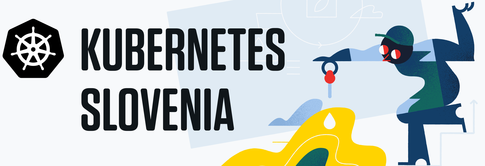

# 3fs k8s Workshop Episode 2

This workshop is intended for users who are already familiar with Kubernetes
basics and want to learn more about describing applications with Kubernetes
objects.

Workshop hands-on tasks will guide you through how to describe and configure a
simple web application and expose it to the outside world.

## Presentation

Accompanying presentation is available at the time of workshop and covers the
following topics:

* Kubernetes object overview.
* `Pod` object configuration details.
* Kubernetes Volumes with `ConfigMap`, `Secret` and `PersistentVolume`.
* Packaging applications with Helm.

## Hands-on

Hands-on tasks are split into three major parts:

* [Basic objects](./01_basic_objects/README.md)
* [Volumes](./02_volumes/README.md)
* [Helm](./03_helm/README.md)

## Additional information

Here you can find some additional information about the workshop:

* [Prerequisites](./00_prerequisites/README.md)
* [Workshop setup](./06_setup/README.md)

## Credits

#### 3fs Infrastructure team

